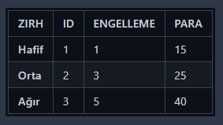

# Macera Oyunu

## Oyunun Tanımı

Bu metin tabanlı macera oyununda, oyuncular çeşitli bölgelerde canavarlarla savaşarak ödüller toplar. Oyuncunun amacı, tüm bölgelerdeki ödülleri toplayarak Güvenli Ev'e dönmektir. Oyuncu, savaş bölgelerindeki tüm düşmanları yendikten sonra bölgeye özel ödülü envanterine ekler. Tüm ödülleri topladıktan sonra Güvenli Ev'e dönen oyuncu oyunu kazanır. Ödül kazanılan bölgeye tekrar giriş yapılamaz.

#### Karakterler

#### Canavarlar

#### Silahlar

#### Zırhlar

#### Mekanlar
* ##### Güvenli Ev
  * Özellik: Can Yenileniyor

* ##### Mağara
  * Canavar: Zombi (1-3 Adet)
  * Özellik: Savaş + Ganimet
  * Eşya: Yemek (Food)

* ##### Orman
  * Canavar: Vampir (1-3 Adet)
  * Özellik: Savaş + Ganimet
  * Eşya: Odun (Firewood)

* ##### Nehir
  * Canavar: Ayı (1-3 Adet)
  * Özellik: Savaş + Ganimet
  * Eşya: Su (Water)

* ##### Mağaza
  * Özellik: Destekleyici Eşyalar Satın Almak
  * Silahlar: Tabanca, Kılıç, Tüfek
  * Zırhlar: Hafif, Orta, Ağır

* ##### Maden (Yeni Bölge)
  * Canavar: Yılan (1-5 Adet)
  * Özellik: Savaş ve Ganimet
  * Eşya: Para, Silah veya Zırh
  * Yılan Özellikleri:
    * ID: 4
    * HASAR: Rastgele (3 ve 6 arası)
    * SAĞLIK: 12
    * PARA: Yok (Onun yerine eşya kazanma ihtimali)

######   Maden Bölgesinde Kazanma İhtimalleri
* Silah Kazanma İhtimali: %15
  * Tüfek: %20
  * Kılıç: %30
  * Tabanca: %50
* Zırh Kazanma İhtimali: %15
  * Ağır Zırh: %20
  * Orta Zırh: %30
  * Hafif Zırh: %50
* Para Kazanma İhtimali: %25
  * 10 Para: %20
  * 5 Para: %30
  * 1 Para: %50
* Hiçbir Şey Kazanmama İhtimali: %45

## Oyunun Kuralları

1. Oyunu bitirebilmek için savaş bölgelerindeki tüm düşmanlar temizlendikten sonra bölgeye özel ödül oyuncunun envanterine eklenmelidir. Eğer oyuncu tüm ödülleri toplayıp "Güvenli Eve" dönebilirse oyunu kazanır. Ayrıca ödül kazanılan bölgeye tekrar giriş yapılamaz.
   * Bölge Ödülleri:
     * Mağara: Yemek (Food)
     * Orman: Odun (Firewood)
     * Nehir: Su (Water)
2. Oyunu bitirebilmek için savaş bölgelerindeki tüm düşmanlar temizlendikten sonra bölgeye özel ödül oyuncunun envanterine eklenmelidir. Eğer oyuncu tüm ödülleri toplayıp "Güvenli Eve" dönebilirse oyunu kazanır. Ayrıca ödül kazanılan bölgeye tekrar giriş yapılamaz.
3. Yeni bir savaş bölgesi eklenmelidir. Bu bölgenin amacı yenilen rakiplerden rastgele para, silah veya zırh kazanma ihtimali olmasıdır.
 
* Bölge Adı: Maden
  * Canavar: Yılan (1-5 Adet)
  * Özellik: Savaş ve Ganimet
  * Eşya: Para, Silah veya Zırh
  * Yılan Özellikleri:
    * ID: 4
    * HASAR: Rastgele (3 ve 6 arası)
    * SAĞLIK: 12
    * PARA: Yok (Onun yerine eşya kazanma ihtimali)

## Nasıl Oynanır
1. Oyunu başlatın ve karakterinizi oluşturun.
2. Bölgeler arasında gezerek canavarlarla savaşın ve ödüller toplayın.
3. Tüm ödülleri toplayıp Güvenli Eve dönerek oyunu kazanın.
4. Mağaza'dan destekleyici eşyalar satın alarak karakterinizi güçlendirin.
5. Şans faktörünü göz önünde bulundurarak stratejik hamleler yapın.

Keyifli oyunlar!